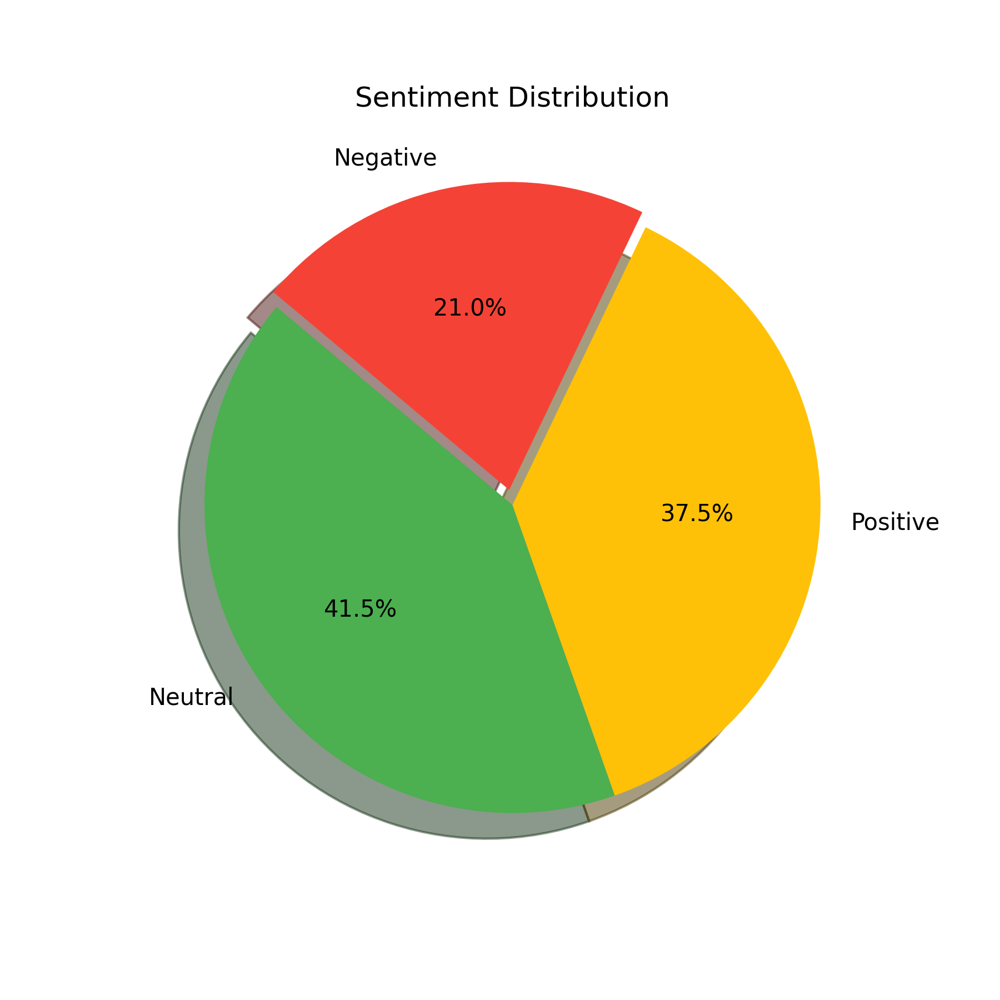

# ⚖️ AI Legal Sentiment Analyzer

Final Project – IBM GENAI  
Submitted by – Rudra Gupta

---

## 🎯 Project Overview

The **AI Legal Sentiment Analyzer** is a Python-based tool that uses **IBM WatsonX** to:
- 📊 Detect the **sentiment** of legal case statements (Positive, Neutral, or Negative)
- 🧠 Generate **legally accurate summaries** of each statement
- 📈 Provide visual sentiment insights using **pie charts**

It processes PDFs and CSVs, making it easy for legal professionals, students, and researchers to understand and interpret legal texts at scale.

---

## 🚀 Features

- 📁 Upload **PDF** or **CSV** legal documents
- 🔍 **WatsonX LLM-based Sentiment Classification**
- 🧠 **Legal Summarization** in one accurate sentence
- 📊 **Pie Chart Output** as `sentiment_chart.png`
- 📄 **CSV Result File** with sentiment & summary
- 🖥️ Command-line interface with live status tracking
- 📦 Clean & testable project structure

---

## 📁 Project Structure

```

ai-legal-sentiment-analyzer/
│
├── main.py                   # Main script
├── requirements.txt          # Python dependencies
├── .env                      # API credentials (excluded from GitHub)
├── sample_data               # Sample test files
│   ├── large_sample_legal_data.csv
│   └── small_sample_legal_data.csv
├── result.csv                # Final analysis results
├── sentiment_pie_chart.png   # Pie chart of sentiment breakdown
├── exports                   # Cases Stored in exports according to their sentiments
│   ├── Negative
|   ├── Neutral
│   └── Positive
├── README.md               # This file

````

---

## 🛠️ Setup Instructions

### 1. Clone the Repository

```bash
git clone https://github.com/your-username/ai-legal-sentiment-analyzer.git
cd ai-legal-sentiment-analyzer
````

### 2. Create and Activate Virtual Environment (optional but recommended)

```bash
python -m venv venv
source venv/bin/activate  # On Windows: venv\Scripts\activate
```

### 3. Install Dependencies

```bash
pip install -r requirements.txt
```

### 4. Set Up Environment Variables

Create a `.env` file in the project root:

```env
WATSONX_API_KEY=your_ibm_api_key
WATSONX_ENDPOINT=https://your-watsonx-endpoint-url
PROJECT_ID=your_project_id
```

### 5. Run the Tool

```bash
python main.py
```

Then enter the path to your PDF or CSV file when prompted.

---

## 📊 Sample Output

### ➤ result.csv

| id | text                                    | sentiment | summary                                 |
| -- | --------------------------------------- | --------- | --------------------------------------- |
| 1  | The defendant was found guilty...       | Negative  | The defendant was convicted of a crime. |
| 2  | The case was resolved amicably...       | Positive  | The case was resolved out of court.     |
| 3  | Due to lack of evidence, case dismissed | Neutral   | The case was dismissed.                 |

---

### ➤ sentiment_pie_chart.png

* A **pie chart** that visually shows how many cases were Positive, Negative, or Neutral.
* Automatically saved in the root directory.



---

## 💡 How It Works

* **PDF or CSV Reading**: Automatically detects file type
* **Text Extraction**: Uses `pdfminer.six` or `pandas`
* **WatsonX Prompt Engineering**: Custom prompts for legal sentiment and summarization
* **Sleep Timer**: Added to avoid WatsonX rate-limiting
* **Chart Plotting**: Uses `matplotlib` for a clean pie chart
* **CSV Output**: Saved in `result.csv` for further usage

---

## 🧪 Sample Terminal Output

```bash
📂 Enter path to legal file (PDF or CSV): sample_data/sample2.csv

🔍 Analyzing Row 1: The defendant was found guilty...
🧠 Sentiment → Negative | 📝 Summary → The defendant was convicted of a crime.

🔍 Analyzing Row 2: The case was resolved...
🧠 Sentiment → Positive | 📝 Summary → The case was resolved out of court.

✅ CSV saved as result.csv
✅ Pie chart saved as sentiment_chart.png
```

---

## 🔧 Technical Stack

| Component      | Tool/Library             |
| -------------- | ------------------------ |
| Language       | Python 3.10+             |
| LLM            | IBM WatsonX (FLAN-T5 XL) |
| PDF Parsing    | pdfminer.six             |
| CSV Handling   | pandas                   |
| Visualization  | matplotlib               |
| Env Management | python-dotenv            |
| HTTP Requests  | requests                 |

---

## 🤝 Contributing

Pull requests and feedback are always welcome. Feel free to open issues or suggestions!

---

## 📞 Support

If you face any issues:

* 🔑 Check your `.env` credentials
* 📡 Verify you have internet access
* 📄 Ensure file is a valid PDF/CSV
* 📦 Reinstall with `pip install -r requirements.txt`

---

* Project submitted as part of the **IBM WatsonX GENAI Final Certification**
* Helping legal professionals **understand complex legal texts** quickly using **GenAI** 🚀

```
